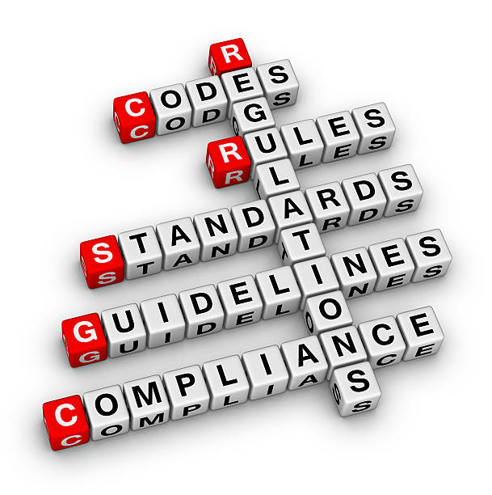

*"Programming is the art of telling another human being what one wants the computer to do."* ― Donald Ervin Knuth

## Why are Coding Standards Important

Code aren't just instructions to be read by computers, moreover, they are also meant to be read by humans. Coding standards are important because of that concept. Writing clean, structured, and standardized code ensures that it is not only functional but also readable, maintainable, and scalable. In collaborative projects, coding standards are important for developers, including your future self, to be able to understand, modify, and build off the code. This improves teamwork, reduces errors, and ensures long-term efficiency in software development.

## Good vs Bad Code

The difference between good and bad code is more than just how a program runs, sure you can have more efficient algorithmns, but have clean and well written code is what a project could really build on.

## Examples

First, lets look at this program.
```
function f(n){
  if(n<0) return "error"
  if(n==0)return 1
  else return n*f(n-1)}
```

This program violates multiple coding standards, making it difficult to read, understand, and maintain. It has poor and unclear naming standards for both functions and error types. The function name provides no indication of what the program does. While developers may still recognize its purpose in a simple program, poor naming conventions become a major issue in larger, more complex projects, where readability and maintainability are crucial.

Additionally, just returning "error" is an inadequate approach to handling invalid input. A well-structured error-handling approach should be consistent, informative, and attention-grabbing, making it easier to identify and debug issues quickly. Providing meaningful error messages or implementing proper exception handling ensures that problems can be efficiently diagnosed and resolved.

## Example Continued

This following program is the above program that addresses some of these problems.

```
function factorial(n: number): number {
    if (n < 0) {
        throw new Error(
            "ERROR:
            Invalid input for function factorial()
            Factorial is not defined for negative numbers.");
    }
    if (n === 0 || n === 1) {
        return 1;
    }
    return n * factorial(n - 1);
}
```

This improved version follows clean coding principles, making it more readable, maintainable, and scalable. The function's name, factorial, clearly describes the purpose of the function. It also includes clear error handling, as well as giving types to its inputs and outputs. Most importantly, the code is constructed to be structured, clear, and easily readable. Following these practices consistently allows functions to be easily understood and integrated, ensuring long term efficiency.

## Conclusion

Well written code follows clean coding principles and remains consistent with them. If you do something once make sure it remains consistent with the entirety of your code. During my current programming course, we reinforce this consistency using a program called Eslint, it is automated to be able to point out not only errors, but also mark improper coding practices that is able to be toggled on and off for many options, like including new lines and which quotation marks to use. It is very useful at keeping consistency between all of your developers by simply using an uniform setting. Adhering to these standards and following it uniformly allows projects to be built using sustainable and scalable code.

- ChatGPT is used to assist in writing this essay only in word choice, spelling, and grammar. As well as assistance in writing the code snippets.


