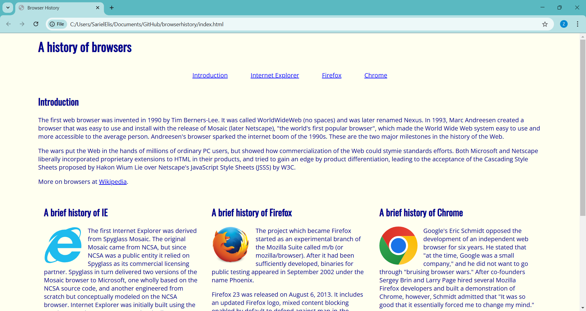

## Introduction
My first time using Bootstrap was to basically reimplement one of my previous tutorial webpages, using simple classes like navbar, rows, and columns without much customization. On the left is my original page using traditional CSS, while the other is made using only Bootstrap.

| style.css | BootStrap |
| ------------- | ------------- |
|   |  |

At a first glance, these pages aren't that different, but as I looked more... Well, they still aren't so different. My initial experience is that I found them more troublesome than helpful. Right that first webpage, I asked myself, what is the point of learning all these classes and functions when they could all be achieved in css anyways? But my opinions and views soon changed after developing more pages using Bootstrap.

## My Experience with BootStrap

What I found great about Bootstrap became clear after the third time I used it to develop a website. This time, the project was much more complicated, requiring specific formatting. I initially thought, No way is Bootstrap good for this. But as I worked, I began to realize something: Bootstrap wasn't meant to replace CSS but to supplement it. My views on bootstrap turned to something like this:

*""You can't build a great building on a weak foundation"* ― Gordon B. Hinckley

As the quote said what is great about bootstrap is how it works as a foundation. The limited design customization of Bootstrap allows developers to quickly create something functional and visually presentable while saving detailed customization for later. Bootstrap's built-in classes are easy to reuse and efficiently address challenges like responsive design across different screen sizes. Additionally, Bootstrap is designed to work seamlessly with custom CSS, making it easy to tailor styles beyond its default utility classes.

## Conclusion

UI frameworks takes care of troubleshooting and trying to get css to respond the way you want it to. Bootstrap serves as a foundational tool for rapid development while still keeping the designer's ability to freely customize. While it may seem restrictive at first, it significantly speeds up development and provides consistency across web projects. By balancing Bootstrap’s built-in styles with personalized CSS, developers can create efficient, responsive, and visually appealing websites.

- ChatGPT is used to assist in writing this essay only in word choice, spelling, and grammar.

