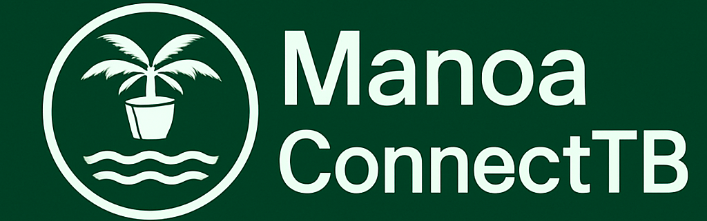
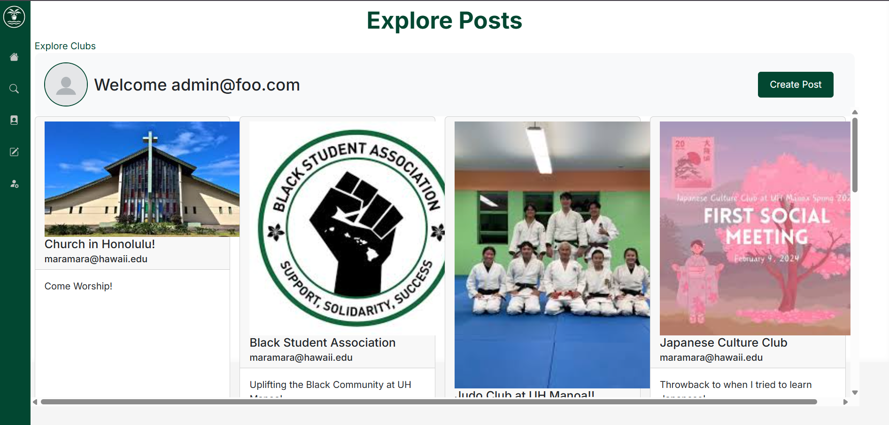
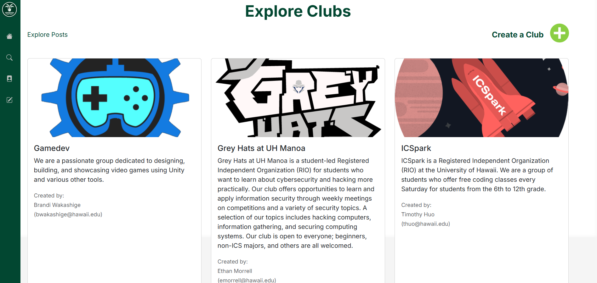
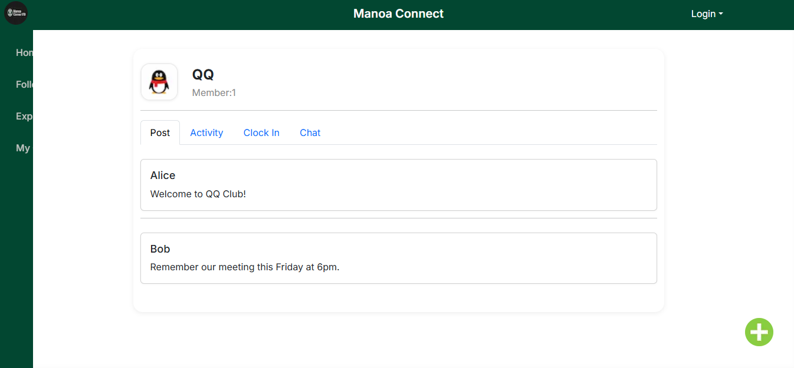

## Overview

Manoa Connect TB is a centralized platform designed to help students at the University of Hawaiʻi at Mānoa discover and interact with campus clubs and organizations. Built using React, Next.js, and Vercel Database, the website provides features such as:
 - Posting Moments: Students can share updates and photos with the community

 - Explore and Join Clubs: Students can browse through active campus clubs and join the ones they are interested in
  

 - Schedule Activites: Clubs can create and manage events and RSVP for upcoming meetings

## My Contributions

I primarily focused on resolving issues, fixing bugs, and handling conflicting merge requests. These tasks often took the most time because they required a solid understanding of everyone’s code across the project. It wasn’t easy, but with the support of my group members, especially when I needed clarification or background information, I was able to effectively address those challenges. Ensuring that my team can continue to work on implementing new features and testing it on a working program.

In addition, I developed the Post feature, which allows users to upload both photos and text to share their moments with the community. This involved handling file uploads, UI interactions, and integrating with the database. I also contributed to other key parts of the application, including creating the Admin page, which enables site administrators to view, manage, and moderate all posts and clubs.

## What I Learned

Beyond technical skills, the most valuable thing I learned was how to work effectively in a team-based programming environment. I gained experience with:

- Task planning and delegation
- Scheduling and time management
- Collaborative Coding/Problem Solving

Knowing how to communicate clearly, adapt to team workflows, and overcome obstacles together is something I’ll carry with me into future projects and professional environments. These real-world collaboration skills are just as important as writing clean code.

Learn more at: <a href="https://manoaconnecttb.github.io/"><i class="large github icon "></i>ManoaConnectIO</a>
