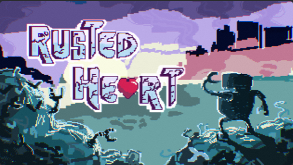

Rusted Heart is a Unity-based game developed collaboratively by the Gamedev Club at the University of Hawaiʻi at Mānoa. The game tells the story of a robot who embarks on an adventure to save their sister, whose heart is failing. Players engage in exciting rhythm-based combat mechanics while exploring an immersive world. The game combines exploration, emotional storytelling, and rhythm-based combat mechanics to create a unique and immersive gameplay experience. With dialogue and combat options with each of the enemy side characters to befriend or take what you from them by force, which will have consequences later down the line.

I was responsible for implementing the map and dialogue systems in the game. The maps guided the player's movements, while the dialogue system facilitated story progression and character interactions. By designing these components, I ensured that the gameplay and player interactions felt engaging, supporting the overall narrative of the game. I implemented a branching dialogue system with functions to trigger options and events, reusable without changing the script's source code, by using different arguments for dialogue and event triggers. This system was essential to reinforcing both the game's mechanics and narrative.

This project taught me valuable lessons in collaboration and technical implementation. I deepened my understanding of Unity's tools, including collisions, different types of hitboxes for different interactions, UI systems, as well as designing reusable scripts. Additionally, I enhanced my ability to communicate and work as part of a team, aligning and collaborating with other members to create one cohesive project.

Link to the Game: <a href="https://uhmanoagamedev.itch.io/rusted-heart"><i class="large github icon "></i>Rusted-Heart</a>
