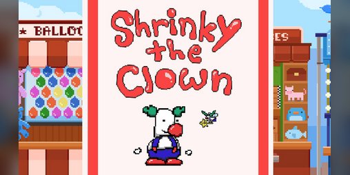

Shrinky the clown is a 2D platformer where you control Shrinky, a clown doll who was granted life, and your goal is to get to the circus performance in time while gathering all the needed props. Shrinky has a unique ability to change in size and turn back into a doll, where depending on his state, he has unique enemies and obstacles that he would have to deal with. The project was quickly made collaboratively within a week for a Game Jam. The game blends classic platforming elements with innovative mechanics and vibrant visuals to create a short, fun, and challenging experience for all players.

My primary contribution to Shrinky the Clown was implementing the game’s enemies, particularly the spider. I designed and programmed the behavior of this enemy, ensuring that spiders only appeared when Shrinky was in his smaller doll form. This added a layer of strategy to the gameplay, as players needed to consider the risks of using Shrinky’s unique abilities. I also worked on integrating these enemies into the game’s levels, which required close collaboration with team members to align with stage design and game mechanics.

Shrinky the Clown was my first project with the UH Mānoa Gamedev Club, and it served as a foundational learning experience. I gained hands-on experience with Unity, including scripting, attaching scripts to objects, assigning prefabs, and moving objects within the game world. This project also taught me the importance of designing mechanics that interact seamlessly with gameplay elements. Implementing the spider enemy helped me understand the balance between challenge and fairness, as I worked to create an engaging experience for players.

Link to the Game: <a href="https://uhmanoagamedev.itch.io/shrinky-the-clown"><i class="large github icon "></i>Shrinky-the-Clown</a>
